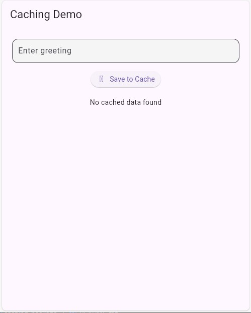
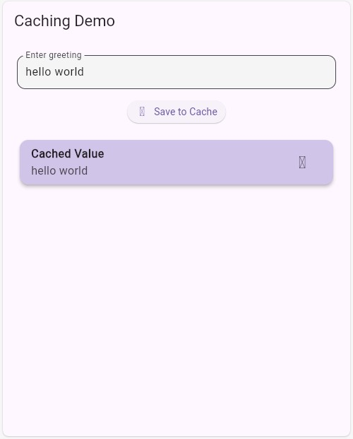

# Caching Package

A lightweight and efficient Flutter package for caching key-value data with optional expiration time support. Built on SharedPreferences, it provides type-safe data persistence with automatic cache invalidation.

[](https://pub.dev/packages/caching_package)
[](https://github.com/yourusername/caching_package/actions)
[](https://opensource.org/licenses/MIT)

## Features

- 🚀 Simple and intuitive key-value data caching
- ⏰ Flexible expiration time for cached items
- 🔒 Type-safe data retrieval with generics support
- 🎯 Automatic cache invalidation
- 💾 Persistent storage using SharedPreferences
- 🔄 Asynchronous API with Future support
- 📱 Cross-platform support (iOS, Android, Web, Desktop)
- 🧪 Well-tested and production-ready

## Demo

### Saving Data to Cache


### Retrieving Data from Cache


## Getting Started

### Installation

1. Add this to your package's `pubspec.yaml` file:

```yaml
dependencies:
  caching_package: ^0.0.1
```

2. Install the package:

```bash
flutter pub get
```

3. Import the package in your Dart code:

```dart
import 'package:caching_package/caching_package.dart';
```

## Usage

### Basic Usage

```dart
// Store data in cache
await CacheManager.set('user_preferences', {
  'theme': 'dark',
  'notifications': true
});

// Retrieve data with type safety
Map<String, dynamic>? preferences = await CacheManager.get<Map<String, dynamic>>('user_preferences');

// Store data with expiration
await CacheManager.set('auth_token', 'xyz123',
    expireAfter: Duration(hours: 24));

// Clear specific data
await CacheManager.remove('auth_token');

// Clear all cached data
await CacheManager.clear();
```

### Advanced Usage

#### Caching Complex Objects

```dart
class User {
  final String name;
  final int age;
  
  User(this.name, this.age);
  
  Map<String, dynamic> toJson() => {
    'name': name,
    'age': age
  };
  
  factory User.fromJson(Map<String, dynamic> json) => User(
    json['name'] as String,
    json['age'] as int
  );
}

// Store complex object
final user = User('John Doe', 30);
await CacheManager.set('current_user', user.toJson());

// Retrieve and convert back to object
final userData = await CacheManager.get<Map<String, dynamic>>('current_user');
final cachedUser = userData != null ? User.fromJson(userData) : null;
```

#### Error Handling

```dart
try {
  await CacheManager.set('important_data', 'sensitive_info');
} catch (e) {
  print('Failed to cache data: $e');
}

try {
  final data = await CacheManager.get<String>('important_data');
  // Handle data
} catch (e) {
  print('Failed to retrieve cached data: $e');
}
```

#### Working with Lists

```dart
// Cache a list of items
List<String> todos = ['Buy milk', 'Walk dog', 'Do laundry'];
await CacheManager.set('todo_list', todos);

// Retrieve the list
List<dynamic>? cachedTodos = await CacheManager.get<List>('todo_list');
List<String> todoList = cachedTodos?.cast<String>() ?? [];
```

## API Reference

### CacheManager

#### Methods

##### `static Future<void> set(String key, dynamic value, {Duration? expireAfter})`
- Stores data in the cache with an optional expiration duration
- Parameters:
  - `key`: Unique identifier for the cached data
  - `value`: Data to be cached (must be JSON serializable)
  - `expireAfter`: Optional duration after which the data expires

##### `static Future<T?> get<T>(String key)`
- Retrieves typed data from the cache
- Parameters:
  - `key`: Unique identifier for the cached data
  - `T`: Type parameter for type-safe data retrieval
- Returns: The cached value of type T, or null if not found or expired

##### `static Future<void> remove(String key)`
- Removes specific data from the cache
- Parameters:
  - `key`: Unique identifier for the cached data

##### `static Future<void> clear()`
- Clears all cached data

## Best Practices

1. **Type Safety**: Always specify the correct type when retrieving data:
   ```dart
   final count = await CacheManager.get<int>('counter');
   ```

2. **Error Handling**: Implement proper error handling for cache operations

3. **Expiration Times**: Set appropriate expiration times for sensitive data

4. **Complex Objects**: Implement `toJson` and `fromJson` for complex objects

## Contributing

Contributions are welcome! Here's how you can help:

1. Fork the repository
2. Create your feature branch: `git checkout -b feature/amazing-feature`
3. Commit your changes: `git commit -m 'Add amazing feature'`
4. Push to the branch: `git push origin feature/amazing-feature`
5. Open a Pull Request

## Issues and Feedback

Please file issues, bugs, or feature requests in our [issue tracker](https://github.com/yourusername/caching_package/issues).

## License

This project is licensed under the MIT License - see the [LICENSE](LICENSE) file for details.